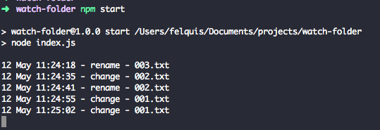

## Watch files

When a file is:
 - changed: emmits the `change` event
 - renamed: emmits the `rename` event
 - deleted: emmits the `rename` event
 - created: emmits the `rename` event

Check out the NodeJS Documentation for the [fs.watch](https://nodejs.org/docs/latest-v5.x/api/fs.html#fs_fs_watch_filename_options_listener) method

Clone this repo, and run
```sh
npm start

# or

node index.js
```

Print screen


